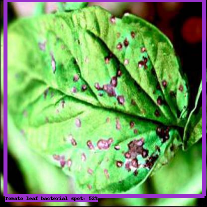
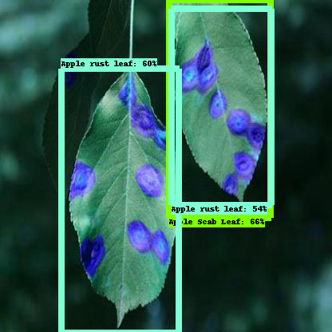
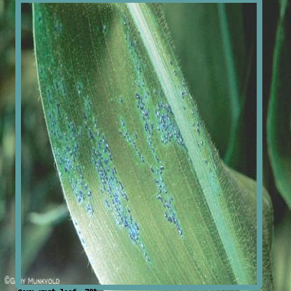
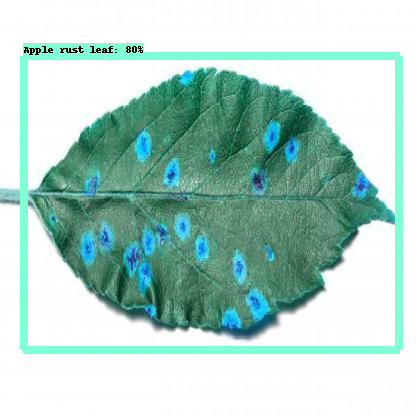
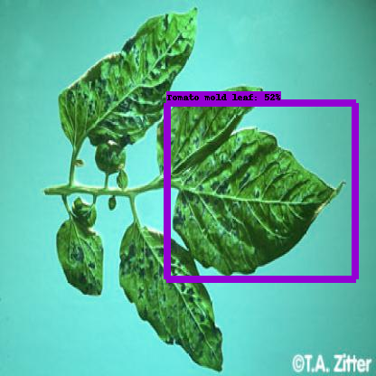

<h1>Leaf and Disease</h1>

    <h3>Problem Statement</h3>
    

    There are a lot of trees we can find in our surroundings. Sometimes tree leaves 
are affected by different types of diseases. Is it possible to make any system 
which can identify the leaf and its diseases easily.  
    

    <h3>Solution</h3>
    

        Efficient D0 is trained for the detection task. It is a lightweight 
model and mAP on COCO dataset is also good. Therefore, I choose the model.
I trained the model with its default settings and it's showing moderate
performance. I also convert it to tflite format for edge deployment.
    

    <h3>How to use the API?</h3>
    <ul>
        <li>Convert image to base64 string.</li>
        <li>Install python 3.10.</li>
        <li>Run: pip install -r requirements.txt</li>
        <li>Run: uvicorn main:app</li>
        <li>Visit: http://127.0.0.1:8000/docs</li>
        <li>Use interface to give the base64 string as input.</li>
        <li>Get predictions.</li>
        <li>To visualize the predicted image convert base64 string to image.</li>
    </ul>

    <h3>Conclusion</h3>
    

        For hardware limitations, it's only trained with few number of
training steps. Approximately 5K. The loss can be optimized more with
further training. Overall the model is giving good predictions.
    

    <h3>Evaluation Metrics: Please check <strong>results/result.csv</strong></h3>
    

        <strong>
Test Images
</strong>
        
        
        
        
        
    

    

    

